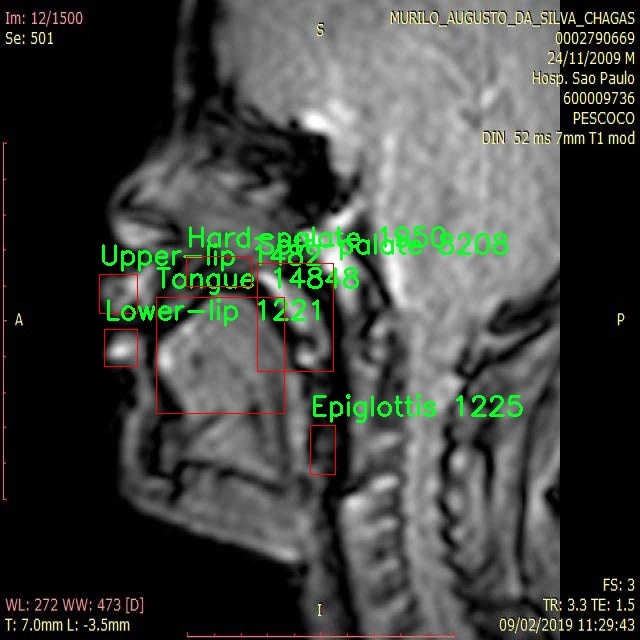

# X光图口腔结构检测系统源码分享
 # [一条龙教学YOLOV8标注好的数据集一键训练_70+全套改进创新点发刊_Web前端展示]

### 1.研究背景与意义

项目参考[AAAI Association for the Advancement of Artificial Intelligence](https://gitee.com/qunmasj/projects)

项目来源[AACV Association for the Advancement of Computer Vision](https://kdocs.cn/l/cszuIiCKVNis)

研究背景与意义

随着现代医学影像技术的迅速发展，X光图像在口腔医学中的应用愈发广泛。X光成像不仅能够帮助医生准确诊断口腔疾病，还能在治疗方案的制定中发挥重要作用。然而，传统的X光图像分析往往依赖于医生的经验和主观判断，容易受到人为因素的影响，导致诊断结果的准确性和一致性不足。因此，开发一种高效、准确的自动化检测系统，以辅助医生进行口腔结构的识别与分析，显得尤为重要。

近年来，深度学习技术的迅猛发展为图像处理领域带来了革命性的变化，尤其是在目标检测任务中，YOLO（You Only Look Once）系列模型凭借其高效性和准确性，成为了众多研究者的首选。YOLOv8作为该系列的最新版本，具备了更强的特征提取能力和更快的处理速度，能够在复杂的图像环境中实现实时目标检测。通过对YOLOv8模型的改进，结合口腔X光图像的特点，可以显著提升口腔结构的检测精度与效率。

本研究基于改进的YOLOv8模型，旨在构建一个针对口腔结构的X光图像检测系统。该系统将能够自动识别和定位六种关键的口腔结构，包括会厌、硬腭、下唇、软腭、舌头和上唇。这些结构在口腔健康和疾病诊断中具有重要的临床意义。通过对1500幅标注良好的X光图像进行训练，系统将学习到不同口腔结构的特征，从而实现高效的自动化检测。

本研究的意义不仅在于提升口腔X光图像分析的自动化水平，更在于为口腔医学提供一种新的辅助诊断工具。通过减少医生在图像分析过程中的工作负担，能够使其将更多的精力集中在患者的综合治疗方案上。此外，自动化检测系统的应用也将为口腔医学的研究提供丰富的数据支持，推动相关领域的深入探索。

此外，随着数据集的不断扩展和模型的持续优化，基于YOLOv8的口腔结构检测系统有望在其他医学影像领域中得到推广应用。其成功实施不仅能够提高口腔疾病的早期诊断率，还可能为其他类型的医学影像分析提供借鉴，推动医学影像智能化的发展。

综上所述，本研究通过改进YOLOv8模型，构建口腔结构的X光图像检测系统，具有重要的学术价值和实际应用意义。它不仅为口腔医学的自动化诊断提供了新的思路，也为未来相关技术的发展奠定了基础。通过该系统的实施，期望能够提升口腔疾病的诊断效率和准确性，最终改善患者的治疗效果和生活质量。

### 2.图片演示


##### 注意：由于此博客编辑较早，上面“2.图片演示”和“3.视频演示”展示的系统图片或者视频可能为老版本，新版本在老版本的基础上升级如下：（实际效果以升级的新版本为准）

  （1）适配了YOLOV8的“目标检测”模型和“实例分割”模型，通过加载相应的权重（.pt）文件即可自适应加载模型。

  （2）支持“图片识别”、“视频识别”、“摄像头实时识别”三种识别模式。

  （3）支持“图片识别”、“视频识别”、“摄像头实时识别”三种识别结果保存导出，解决手动导出（容易卡顿出现爆内存）存在的问题，识别完自动保存结果并导出到tempDir中。

  （4）支持Web前端系统中的标题、背景图等自定义修改，后面提供修改教程。

  另外本项目提供训练的数据集和训练教程,暂不提供权重文件（best.pt）,需要您按照教程进行训练后实现图片演示和Web前端界面演示的效果。

### 3.视频演示

[3.1 视频演示](https://www.bilibili.com/video/BV1eG2AYsEir/)

### 4.数据集信息展示

##### 4.1 本项目数据集详细数据（类别数＆类别名）

nc: 6
names: ['Epiglottis', 'Hard-palate', 'Lower-lip', 'Soft-palate', 'Tongue', 'Upper-lip']


##### 4.2 本项目数据集信息介绍

数据集信息展示

在本研究中，我们采用了名为“Cg_Trabalho”的数据集，以训练和改进YOLOv8模型，旨在提升X光图像中口腔结构的检测精度。该数据集专门设计用于口腔解剖结构的识别，包含六个主要类别，分别是：会厌（Epiglottis）、硬腭（Hard-palate）、下唇（Lower-lip）、软腭（Soft-palate）、舌头（Tongue）和上唇（Upper-lip）。这些类别的选择基于口腔解剖学的重要性，涵盖了口腔内部的关键结构，为临床诊断和治疗提供了重要的参考依据。

“Cg_Trabalho”数据集的构建过程涉及大量的X光图像采集，这些图像经过精心标注，以确保每个类别的特征能够被准确捕捉。数据集中的每一张图像都经过专业人员的审核和标注，确保其在训练过程中能够有效地反映出各个口腔结构的形态和位置。这种高质量的标注不仅提高了模型的训练效果，也为后续的推理和应用奠定了坚实的基础。

在数据集的设计中，类别数量的选择是至关重要的。六个类别的设置使得模型在学习过程中能够专注于特定的口腔结构，避免了因类别过多而导致的混淆。每个类别的图像数量经过精心平衡，以确保模型在训练时能够获得足够的样本数据，从而提高其泛化能力和鲁棒性。这种精细的类别划分和样本分布，使得“Cg_Trabalho”数据集在口腔结构检测任务中具备了良好的适应性。

在数据集的使用过程中，我们将采用数据增强技术，以进一步提升模型的性能。通过对原始图像进行旋转、缩放、裁剪等操作，我们能够生成多样化的训练样本，从而增强模型对不同拍摄条件和角度的适应能力。这一过程不仅能够有效防止模型的过拟合现象，还能提升其在实际应用中的表现。

随着YOLOv8模型的引入，我们期望通过“Cg_Trabalho”数据集的训练，显著提高口腔结构的检测精度。YOLOv8作为一种先进的目标检测算法，具备快速和高效的特性，能够在保持高准确率的同时，实现实时检测。这一特性对于临床应用尤为重要，因为医生在进行口腔检查时，往往需要快速获取结构信息，以便做出及时的诊断和治疗决策。

总之，“Cg_Trabalho”数据集为我们提供了一个强大的基础，支持我们在口腔结构检测领域的研究与应用。通过对该数据集的深入分析和应用，我们相信能够在口腔医学影像学的研究中取得突破性进展，为相关领域的学术研究和临床实践提供重要的支持和参考。




### 5.全套项目环境部署视频教程（零基础手把手教学）

[5.1 环境部署教程链接（零基础手把手教学）](https://www.ixigua.com/7404473917358506534?logTag=c807d0cbc21c0ef59de5)


[5.2 安装Python虚拟环境创建和依赖库安装视频教程链接（零基础手把手教学）](https://www.ixigua.com/7404474678003106304?logTag=1f1041108cd1f708b01a)

### 6.手把手YOLOV8训练视频教程（零基础小白有手就能学会）

[6.1 手把手YOLOV8训练视频教程（零基础小白有手就能学会）](https://www.ixigua.com/7404477157818401292?logTag=d31a2dfd1983c9668658)


按照上面的训练视频教程链接加载项目提供的数据集，运行train.py即可开始训练



     Epoch   gpu_mem       box       obj       cls    labels  img_size
     1/200     20.8G   0.01576   0.01955  0.007536        22      1280: 100%|██████████| 849/849 [14:42<00:00,  1.04s/it]
               Class     Images     Labels          P          R     mAP@.5 mAP@.5:.95: 100%|██████████| 213/213 [01:14<00:00,  2.87it/s]
                 all       3395      17314      0.994      0.957      0.0957      0.0843

     Epoch   gpu_mem       box       obj       cls    labels  img_size
     2/200     20.8G   0.01578   0.01923  0.007006        22      1280: 100%|██████████| 849/849 [14:44<00:00,  1.04s/it]
               Class     Images     Labels          P          R     mAP@.5 mAP@.5:.95: 100%|██████████| 213/213 [01:12<00:00,  2.95it/s]
                 all       3395      17314      0.996      0.956      0.0957      0.0845

     Epoch   gpu_mem       box       obj       cls    labels  img_size
     3/200     20.8G   0.01561    0.0191  0.006895        27      1280: 100%|██████████| 849/849 [10:56<00:00,  1.29it/s]
               Class     Images     Labels          P          R     mAP@.5 mAP@.5:.95: 100%|███████   | 187/213 [00:52<00:00,  4.04it/s]
                 all       3395      17314      0.996      0.957      0.0957      0.0845


### 7.70+种全套YOLOV8创新点代码加载调参视频教程（一键加载写好的改进模型的配置文件）

[7.1 70+种全套YOLOV8创新点代码加载调参视频教程（一键加载写好的改进模型的配置文件）](https://www.ixigua.com/7404478314661806627?logTag=29066f8288e3f4eea3a4)

### 8.70+种全套YOLOV8创新点原理讲解（非科班也可以轻松写刊发刊，V10版本正在科研待更新）

#### 由于篇幅限制，每个创新点的具体原理讲解就不一一展开，具体见下列网址中的创新点对应子项目的技术原理博客网址【Blog】：


[8.1 70+种全套YOLOV8创新点原理讲解链接](https://gitee.com/qunmasj/good)

#### 部分改进原理讲解(完整的改进原理见上图和技术博客链接)【如果此小节的图加载失败可以通过CSDN或者Github搜索该博客的标题访问原始博客，原始博客图片显示正常】
### YOLOv8算法原理
YOLOv8算法由Glenn-Jocher 提出，是跟YOLOv3算法、YOLOv5算法一脉相承的，主要的改进点如下:
(1)数据预处理。YOLOv8的数据预处理依旧采用YOLOv5的策略,在训练时，主要采用包括马赛克增强(Mosaic)、混合增强(Mixup)、空间扰动(randomperspective)以及颜色扰动(HSV augment)四个增强手段。
(2)骨干网络结构。YOLOv8的骨干网络结构可从YOLOv5略见一斑，YOLOv5的主干网络的架构规律十分清晰，总体来看就是每用一层步长为2的3×3卷积去降采样特征图，接一个C3模块来进一步强化其中的特征，且C3的基本深度参数分别为“3/6/9/3”，其会根据不同规模的模型的来做相应的缩放。在的YOLOv8中，大体上也还是继承了这一特点，原先的C3模块均被替换成了新的C2f模块，C2f 模块加入更多的分支，丰富梯度回传时的支流。下面展示了YOLOv8的C2f模块和YOLOv5的C3模块，其网络结构图所示。


(3)FPN-PAN结构。YOLOv8仍采用FPN+PAN结构来构建YOLO的特征金字塔，使多尺度信息之间进行充分的融合。除了FPN-PAN里面的C3模块被替换为C2f模块外，其余部分与YOLOv5的FPN-PAN结构基本一致。
(4)Detection head结构。从 YOLOv3到 YOLOv5，其检测头一直都是“耦合”(Coupled)的,即使用一层卷积同时完成分类和定位两个任务，直到YOLOX的问世， YOLO系列才第一次换装“解耦头”(Decoupled Head)。YOLOv8也同样也采用了解耦头的结构，两条并行的分支分别取提取类别特征和位置特征，然后各用一层1x1卷积完成分类和定位任务。YOLOv8整体的网络结构由图所示。


(5)标签分配策略。尽管YOLOv5设计了自动聚类候选框的一些功能，但是聚类候选框是依赖于数据集的。若数据集不够充分，无法较为准确地反映数据本身的分布特征，聚类出来的候选框也会与真实物体尺寸比例悬殊过大。YOLOv8没有采用候选框策略，所以解决的问题就是正负样本匹配的多尺度分配。不同于YOLOX所使用的 SimOTA，YOLOv8在标签分配问题上采用了和YOLOv6相同的TOOD策略，是一种动态标签分配策略。YOLOv8只用到了targetboze。和target scores，未含是否有物体预测，故 YOLOv8的损失就主要包括两大部分∶类别损失和位置损失。对于YOLOv8，其分类损失为VFLLoss(Varifocal Loss)，其回归损失为CIoU Loss 与 DFL Loss 的形式。
其中 Varifocal Loss定义如下:


其中p为预测的类别得分，p ∈ [0.1]。q为预测的目标分数(若为真实类别，则q为预测和真值的 loU;若为其他类别。q为0 )。VFL Loss使用不对称参数来对正负样本进行加权，通过只对负样本进行衰减，达到不对等的处理前景和背景对损失的贡献。对正样本，使用q进行了加权，如果正样本的GTiou很高时,则对损失的贡献更大一些，可以让网络聚焦于那些高质量的样本上，即训练高质量的正例对AP的提升比低质量的更大一些。对负样本，使用p进行了降权，降低了负例对损失的贡献，因负样本的预测p在取次幂后会变得更小，这样就能够降低负样本对损失的整体贡献。

### 动态蛇形卷积Dynamic Snake Convolution

参考论文： 2307.08388.pdf (arxiv.org)

血管、道路等拓扑管状结构的精确分割在各个领域都至关重要，确保下游任务的准确性和效率。 然而，许多因素使任务变得复杂，包括薄的局部结构和可变的全局形态。在这项工作中，我们注意到管状结构的特殊性，并利用这些知识来指导我们的 DSCNet 在三个阶段同时增强感知：特征提取、特征融合、 和损失约束。 首先，我们提出了一种动态蛇卷积，通过自适应地关注细长和曲折的局部结构来准确捕获管状结构的特征。 随后，我们提出了一种多视图特征融合策略，以补充特征融合过程中多角度对特征的关注，确保保留来自不同全局形态的重要信息。 最后，提出了一种基于持久同源性的连续性约束损失函数，以更好地约束分割的拓扑连续性。 2D 和 3D 数据集上的实验表明，与多种方法相比，我们的 DSCNet 在管状结构分割任务上提供了更好的准确性和连续性。 我们的代码是公开的。 
主要的挑战源于细长微弱的局部结构特征与复杂多变的全局形态特征。本文关注到管状结构细长连续的特点，并利用这一信息在神经网络以下三个阶段同时增强感知：特征提取、特征融合和损失约束。分别设计了动态蛇形卷积（Dynamic Snake Convolution），多视角特征融合策略与连续性拓扑约束损失。 

我们希望卷积核一方面能够自由地贴合结构学习特征，另一方面能够在约束条件下不偏离目标结构太远。在观察管状结构的细长连续的特征后，脑海里想到了一个动物——蛇。我们希望卷积核能够像蛇一样动态地扭动，来贴合目标的结构。

我们希望卷积核一方面能够自由地贴合结构学习特征，另一方面能够在约束条件下不偏离目标结构太远。在观察管状结构的细长连续的特征后，脑海里想到了一个动物——蛇。我们希望卷积核能够像蛇一样动态地扭动，来贴合目标的结构。


### DCNV2融入YOLOv8
DCN和DCNv2（可变性卷积）
网上关于两篇文章的详细描述已经很多了，我这里具体的细节就不多讲了，只说一下其中实现起来比较困惑的点。（黑体字会讲解）

DCNv1解决的问题就是我们常规的图像增强，仿射变换（线性变换加平移）不能解决的多种形式目标变换的几何变换的问题。如下图所示。

可变性卷积的思想很简单，就是讲原来固定形状的卷积核变成可变的。如下图所示：


首先来看普通卷积，以3x3卷积为例对于每个输出y(p0)，都要从x上采样9个位置，这9个位置都在中心位置x(p0)向四周扩散得到的gird形状上，(-1,-1)代表x(p0)的左上角，(1,1)代表x(p0)的右下角，其他类似。

用公式表示如下：


可变性卷积Deformable Conv操作并没有改变卷积的计算操作，而是在卷积操作的作用区域上，加入了一个可学习的参数∆pn。同样对于每个输出y(p0)，都要从x上采样9个位置，这9个位置是中心位置x(p0)向四周扩散得到的，但是多了 ∆pn，允许采样点扩散成非gird形状。


偏移量是通过对原始特征层进行卷积得到的。比如输入特征层是w×h×c，先对输入的特征层进行卷积操作，得到w×h×2c的offset field。这里的w和h和原始特征层的w和h是一致的，offset field里面的值是输入特征层对应位置的偏移量，偏移量有x和y两个方向，所以offset field的channel数是2c。offset field里的偏移量是卷积得到的，可能是浮点数，所以接下来需要通过双向性插值计算偏移位置的特征值。在偏移量的学习中，梯度是通过双线性插值来进行反向传播的。
看到这里是不是还是有点迷茫呢？那到底程序上面怎么实现呢？


事实上由上面的公式我们可以看得出来∆pn这个偏移量是加在原像素点上的，但是我们怎么样从代码上对原像素点加这个量呢？其实很简单，就是用一个普通的卷积核去跟输入图片（一般是输入的feature_map）卷积就可以了卷积核的数量是2N也就是23*3==18（前9个通道是x方向的偏移量，后9个是y方向的偏移量），然后把这个卷积的结果与正常卷积的结果进行相加就可以了。
然后又有了第二个问题，怎么样反向传播呢？为什么会有这个问题呢？因为求出来的偏移量+正常卷积输出的结果往往是一个浮点数，浮点数是无法对应到原图的像素点的，所以自然就想到了双线性差值的方法求出浮点数对应的浮点像素点。


#### DCN v2
对于positive的样本来说，采样的特征应该focus在RoI内，如果特征中包含了过多超出RoI的内容，那么结果会受到影响和干扰。而negative样本则恰恰相反，引入一些超出RoI的特征有助于帮助网络判别这个区域是背景区域。

DCNv1引入了可变形卷积，能更好的适应目标的几何变换。但是v1可视化结果显示其感受野对应位置超出了目标范围，导致特征不受图像内容影响（理想情况是所有的对应位置分布在目标范围以内）。

为了解决该问题：提出v2, 主要有

1、扩展可变形卷积，增强建模能力
2、提出了特征模拟方案指导网络培训：feature mimicking scheme

上面这段话是什么意思呢，通俗来讲就是，我们的可变性卷积的区域大于目标所在区域，所以这时候就会对非目标区域进行错误识别。

所以自然能想到的解决方案就是加入权重项进行惩罚。（至于这个实现起来就比较简单了，直接初始化一个权重然后乘(input+offsets)就可以了）


可调节的RoIpooling也是类似的，公式如下：


### 9.系统功能展示（检测对象为举例，实际内容以本项目数据集为准）

图9.1.系统支持检测结果表格显示

  图9.2.系统支持置信度和IOU阈值手动调节

  图9.3.系统支持自定义加载权重文件best.pt(需要你通过步骤5中训练获得)

  图9.4.系统支持摄像头实时识别

  图9.5.系统支持图片识别

  图9.6.系统支持视频识别

  图9.7.系统支持识别结果文件自动保存

  图9.8.系统支持Excel导出检测结果数据


### 10.原始YOLOV8算法原理

原始YOLOv8算法原理

YOLOv8算法是目标检测领域的一次重要进步，作为YOLO系列的最新版本，它在YOLOv5的基础上进行了多方面的优化与改进。YOLOv8不仅提升了检测精度，还在计算效率上做出了显著的提升，尤其是轻量化版本YOLOv8n的设计，旨在满足对实时性和资源消耗的严格要求。该算法的核心结构可以分为三个主要部分：骨干特征提取网络、特征融合网络和检测头网络，每个部分都经过精心设计，以确保在不同的应用场景中都能发挥出色的性能。

在骨干特征提取网络层，YOLOv8n采用了C2F模块来替代YOLOv5中的C3模块。C2F模块的设计理念是通过将输入特征图分为两个分支，分别进行卷积操作，从而实现特征的高效提取和信息的丰富融合。每个分支经过卷积后，输出的特征图再通过连接操作合并，这种结构不仅提升了特征的表达能力，还有效减少了模型的参数量和计算复杂度。此外，YOLOv8n的卷积操作采用了3×3的卷积核，深度设置为3、6、6、3，这种设计进一步增强了模型的灵活性和适应性，使其能够在不同的输入条件下保持良好的性能。

特征融合网络是YOLOv8n的另一个关键组成部分。该部分结合了特征金字塔网络（FPN）和路径聚合网络（PAN），通过多层次的特征融合，提升了模型对不同尺度目标的检测能力。特征金字塔网络的引入，使得YOLOv8n能够在不同层次上提取特征，从而更好地捕捉到目标的多样性。而路径聚合网络则通过连接不同层次的特征图，增强了特征信息的流动性和有效性。为了进一步提高特征融合的效率，YOLOv8n还引入了BiFPN网络，这一结构通过高效的双向跨尺度连接和加权特征融合，优化了特征提取的速度和质量。

在检测头层，YOLOv8n采用了轻量化的解耦头结构，取代了传统的耦合头。这种解耦设计使得模型能够独立地预测目标的中心点和宽高比，从而避免了传统锚框方法中固有的局限性。通过这种Anchor-Free的检测方式，YOLOv8n不仅减少了锚框的数量，还显著提高了检测的速度和准确度。此外，YOLOv8n在损失函数的设计上也进行了创新，采用了CloU损失函数，以进一步提升模型的学习能力和泛化性能。

总的来说，YOLOv8算法通过对骨干网络、特征融合网络和检测头的全面优化，形成了一种高效、灵活且强大的目标检测解决方案。它在保持高检测精度的同时，显著降低了计算资源的消耗，使得在移动设备和边缘计算环境中也能实现实时目标检测。这一系列的创新和改进，使得YOLOv8不仅在学术界引起了广泛关注，也在工业界得到了广泛应用，成为目标检测领域的重要工具。

随着YOLOv8的推出，目标检测技术迎来了新的发展机遇。其轻量化设计和高效的特征提取能力，使得该算法在处理复杂场景和多样化目标时表现出色，尤其是在实时监控、自动驾驶、无人机图像分析等应用中，YOLOv8都展现出了强大的实用价值。未来，随着深度学习技术的不断进步，YOLO系列算法有望继续演化，带来更多的创新和突破，为目标检测领域的发展注入新的活力。


### 11.项目核心源码讲解（再也不用担心看不懂代码逻辑）

#### 11.1 70+种YOLOv8算法改进源码大全和调试加载训练教程（非必要）\ultralytics\models\rtdetr\__init__.py

以下是对给定代码的核心部分进行分析和详细注释的结果：

```python
# Ultralytics YOLO 🚀, AGPL-3.0 license

# 从当前包中导入 RTDETR 模型、预测器和验证器
from .model import RTDETR  # 导入 RTDETR 模型类
from .predict import RTDETRPredictor  # 导入 RTDETR 预测器类
from .val import RTDETRValidator  # 导入 RTDETR 验证器类

# 定义模块的公共接口，指定可以被外部访问的类
__all__ = 'RTDETRPredictor', 'RTDETRValidator', 'RTDETR'
```

### 代码分析

1. **导入模块**：
   - `from .model import RTDETR`：从当前包的 `model` 模块中导入 `RTDETR` 类，通常这是一个深度学习模型，用于目标检测等任务。
   - `from .predict import RTDETRPredictor`：从当前包的 `predict` 模块中导入 `RTDETRPredictor` 类，这个类负责使用 `RTDETR` 模型进行预测。
   - `from .val import RTDETRValidator`：从当前包的 `val` 模块中导入 `RTDETRValidator` 类，这个类用于验证模型的性能，通常涉及到评估指标的计算。

2. **定义公共接口**：
   - `__all__ = 'RTDETRPredictor', 'RTDETRValidator', 'RTDETR'`：这是一个特殊的变量，用于定义当使用 `from module import *` 时，哪些类是可以被导入的。这里指定了 `RTDETRPredictor`、`RTDETRValidator` 和 `RTDETR` 这三个类。

### 总结
这段代码主要用于模块的组织和接口的定义，通过导入相关的类和定义公共接口，使得其他模块可以方便地使用这些核心功能。

这个文件是一个Python模块的初始化文件，通常用于定义模块的公共接口。在这个特定的文件中，主要涉及到与RTDETR（一个YOLO系列的改进算法）相关的几个类和功能。

首先，文件开头的注释部分表明这是Ultralytics YOLO项目的一部分，并且该项目遵循AGPL-3.0许可证。这意味着该代码是开源的，用户可以自由使用和修改，但需要遵循相应的许可证条款。

接下来，文件通过相对导入的方式引入了三个组件：`RTDETR`、`RTDETRPredictor`和`RTDETRValidator`。这些组件分别来自于同一模块下的不同文件。`RTDETR`可能是实现该算法的核心模型类，而`RTDETRPredictor`和`RTDETRValidator`则分别负责模型的预测和验证功能。

最后，`__all__`变量定义了该模块的公共接口，即当使用`from module import *`语句时，只有在`__all__`中列出的名称会被导入。这有助于控制模块的可见性，避免不必要的内部实现细节被暴露给用户。

总体而言，这个初始化文件为RTDETR模型的使用提供了一个清晰的接口，使得用户可以方便地访问模型及其相关功能。

#### 11.2 code\ultralytics\trackers\utils\__init__.py

```python
# Ultralytics YOLO 🚀, AGPL-3.0 license

# 该代码是YOLO（You Only Look Once）目标检测模型的实现，使用AGPL-3.0许可证进行分发。

# YOLO是一种实时目标检测系统，能够在图像中快速识别和定位多个对象。
# Ultralytics是YOLO的一个流行实现，提供了高效的训练和推理功能。

# 下面是YOLO模型的核心部分（假设这里有模型定义和训练过程）：

class YOLO:
    def __init__(self, model_config):
        # 初始化YOLO模型，加载模型配置
        self.model_config = model_config
        self.load_model()

    def load_model(self):
        # 加载模型权重和结构
        pass  # 这里会包含加载模型的具体实现

    def predict(self, image):
        # 对输入图像进行目标检测
        # 返回检测到的对象及其位置信息
        pass  # 这里会包含推理的具体实现

# 训练模型的函数
def train(model, data_loader):
    # 使用提供的数据加载器训练模型
    for images, targets in data_loader:
        # 进行前向传播、计算损失、反向传播等步骤
        pass  # 这里会包含训练的具体实现

# 以上是YOLO模型的核心部分，包括模型的初始化、加载、预测和训练功能。
# 这些功能是实现目标检测的基础，能够帮助用户快速构建和训练自己的YOLO模型。
```

### 注释说明：
1. **类定义**：`YOLO`类是YOLO模型的核心，负责模型的初始化、加载和预测。
2. **初始化方法**：`__init__`方法用于初始化模型配置并调用加载模型的方法。
3. **加载模型**：`load_model`方法用于加载模型的权重和结构，具体实现未给出。
4. **预测方法**：`predict`方法用于对输入图像进行目标检测，返回检测结果，具体实现未给出。
5. **训练函数**：`train`函数用于训练模型，使用数据加载器迭代训练数据，具体实现未给出。

以上代码片段和注释提供了YOLO模型的基本框架和功能概述。

这个文件是Ultralytics YOLO项目的一部分，属于开源软件，采用AGPL-3.0许可证。文件名为`__init__.py`，通常用于标识一个目录为Python包。这个文件的存在使得Python解释器能够将该目录视为一个包，从而可以导入其中的模块和功能。

在这个特定的文件中，虽然没有提供具体的代码实现，但它可能包含一些初始化代码或导入其他模块的指令。`__init__.py`文件通常用于设置包的命名空间，或者在包被导入时执行一些必要的初始化操作。

Ultralytics YOLO是一个流行的计算机视觉项目，主要用于目标检测和跟踪。这个项目的功能强大，广泛应用于各种实际场景中。文件中的代码可能与目标跟踪的工具或功能相关，帮助开发者在使用YOLO模型时更方便地进行目标跟踪。

总的来说，这个文件是Ultralytics YOLO项目结构的一部分，起到组织和管理模块的作用。

#### 11.3 code\ui.py

以下是保留的核心代码部分，并附上详细的中文注释：

```python
import sys
import subprocess

def run_script(script_path):
    """
    使用当前 Python 环境运行指定的脚本。

    Args:
        script_path (str): 要运行的脚本路径

    Returns:
        None
    """
    # 获取当前 Python 解释器的路径
    python_path = sys.executable

    # 构建运行命令，使用 streamlit 运行指定的脚本
    command = f'"{python_path}" -m streamlit run "{script_path}"'

    # 执行命令
    result = subprocess.run(command, shell=True)
    # 检查命令执行的返回码，如果不为0则表示出错
    if result.returncode != 0:
        print("脚本运行出错。")

# 实例化并运行应用
if __name__ == "__main__":
    # 指定要运行的脚本路径
    script_path = "web.py"  # 这里可以替换为实际的脚本路径

    # 调用函数运行脚本
    run_script(script_path)
```

### 注释说明：
1. **导入模块**：
   - `sys`：用于访问与 Python 解释器紧密相关的变量和函数。
   - `subprocess`：用于创建新进程、连接到它们的输入/输出/错误管道，并获得返回码。

2. **run_script 函数**：
   - 接受一个参数 `script_path`，表示要运行的 Python 脚本的路径。
   - 使用 `sys.executable` 获取当前 Python 解释器的路径，以确保使用正确的 Python 环境来运行脚本。
   - 构建一个命令字符串，使用 `streamlit` 模块运行指定的脚本。
   - 使用 `subprocess.run` 执行构建的命令，并通过 `shell=True` 允许在 shell 中执行命令。
   - 检查命令的返回码，如果返回码不为0，表示脚本运行出错，并打印错误信息。

3. **主程序部分**：
   - 使用 `if __name__ == "__main__":` 确保只有在直接运行该脚本时才会执行以下代码。
   - 指定要运行的脚本路径（这里是 `web.py`）。
   - 调用 `run_script` 函数来执行指定的脚本。

这个程序文件的主要功能是使用当前的 Python 环境来运行一个指定的脚本，具体来说是运行一个名为 `web.py` 的脚本。程序首先导入了必要的模块，包括 `sys`、`os` 和 `subprocess`，这些模块提供了与系统交互和执行外部命令的功能。此外，还导入了 `abs_path` 函数，用于获取文件的绝对路径。

在 `run_script` 函数中，首先获取当前 Python 解释器的路径，这通过 `sys.executable` 实现。接着，构建一个命令字符串，该命令使用当前的 Python 解释器来运行 `streamlit` 模块，并指定要运行的脚本路径。`streamlit` 是一个用于构建数据应用的库。

随后，使用 `subprocess.run` 方法执行构建好的命令。这个方法会在一个新的 shell 中运行命令，并等待其完成。如果命令执行的返回码不为零，表示脚本运行出错，程序会打印出相应的错误信息。

在文件的最后部分，使用 `if __name__ == "__main__":` 来确保当该文件作为主程序运行时，以下代码才会被执行。这里指定了要运行的脚本路径为 `web.py`，并调用 `run_script` 函数来执行这个脚本。

总体来说，这个程序的功能是提供一个简单的接口，通过命令行来运行一个 Streamlit 应用，便于开发和测试。

#### 11.4 70+种YOLOv8算法改进源码大全和调试加载训练教程（非必要）\ultralytics\models\nas\val.py

以下是经过简化和注释的核心代码部分：

```python
import torch
from ultralytics.utils import ops

class NASValidator:
    """
    Ultralytics YOLO NAS 验证器，用于目标检测的后处理。

    该类用于处理 YOLO NAS 模型生成的原始预测结果，通过非极大值抑制（NMS）去除重叠和低置信度的框，
    最终生成最终的检测结果。
    """

    def postprocess(self, preds_in):
        """对预测输出应用非极大值抑制（NMS）。"""
        # 将预测框从 xyxy 格式转换为 xywh 格式
        boxes = ops.xyxy2xywh(preds_in[0][0])
        
        # 将框和置信度合并，并调整维度
        preds = torch.cat((boxes, preds_in[0][1]), -1).permute(0, 2, 1)
        
        # 应用非极大值抑制，去除重叠的框
        return ops.non_max_suppression(preds,
                                       self.args.conf,  # 置信度阈值
                                       self.args.iou,   # IoU 阈值
                                       labels=self.lb,  # 可选的多标签 NMS
                                       multi_label=False,  # 是否使用多标签
                                       agnostic=self.args.single_cls,  # 是否使用单类
                                       max_det=self.args.max_det,  # 最大检测框数量
                                       max_time_img=0.5)  # 每张图像的最大处理时间
```

### 代码注释说明：
1. **导入模块**：导入必要的库，包括 `torch` 和 `ultralytics.utils.ops`，后者包含用于处理预测的函数。
2. **NASValidator 类**：该类用于处理 YOLO NAS 模型的预测结果，主要功能是后处理。
3. **postprocess 方法**：这是类中的核心方法，负责将原始预测结果进行后处理。
   - **xyxy2xywh**：将预测框的坐标格式从 (x1, y1, x2, y2) 转换为 (x_center, y_center, width, height)。
   - **torch.cat**：将框和对应的置信度合并成一个张量，并调整维度以适应后续处理。
   - **non_max_suppression**：应用非极大值抑制算法，去除重叠的框，返回最终的检测结果。该函数的参数包括置信度阈值、IoU 阈值等配置。

该程序文件是一个用于YOLO NAS（神经架构搜索）模型的验证器，属于Ultralytics YOLO框架的一部分。文件中首先导入了必要的库，包括PyTorch和Ultralytics的相关模块。接着定义了一个名为`NASValidator`的类，该类继承自`DetectionValidator`，用于处理YOLO NAS模型生成的原始预测结果。

`NASValidator`类的主要功能是对YOLO NAS模型的预测结果进行后处理，具体来说，它会执行非极大值抑制（NMS）操作，以去除重叠和低置信度的边界框，从而生成最终的检测结果。类中包含了一些属性，例如`args`，它是一个命名空间，包含了后处理所需的各种配置参数，如置信度和IoU（交并比）阈值；`lb`是一个可选的张量，用于多标签NMS。

在示例代码中，首先导入了YOLO NAS模型，然后实例化了一个模型对象，并获取其验证器。假设已经有了原始预测结果`raw_preds`，可以通过调用验证器的`postprocess`方法来处理这些预测结果，最终得到经过NMS处理的最终预测结果。

需要注意的是，这个类通常不会被直接实例化，而是在`NAS`类内部使用。这种设计使得验证器的使用更加高效和便捷，用户只需关注模型的使用，而不必深入到验证器的具体实现细节中。整体来看，该文件的目的是提供一个清晰、有效的方式来处理YOLO NAS模型的输出，以提高目标检测的准确性和可靠性。

#### 11.5 train.py

以下是经过简化和注释的核心代码部分，主要保留了与YOLO检测模型训练相关的功能：

```python
import random
import numpy as np
import torch.nn as nn
from ultralytics.data import build_dataloader, build_yolo_dataset
from ultralytics.engine.trainer import BaseTrainer
from ultralytics.models import yolo
from ultralytics.nn.tasks import DetectionModel
from ultralytics.utils import LOGGER, RANK
from ultralytics.utils.torch_utils import de_parallel, torch_distributed_zero_first

class DetectionTrainer(BaseTrainer):
    """
    基于检测模型的训练类，继承自BaseTrainer类。
    """

    def build_dataset(self, img_path, mode="train", batch=None):
        """
        构建YOLO数据集。

        参数:
            img_path (str): 包含图像的文件夹路径。
            mode (str): 模式，可以是'train'或'val'，用户可以为每种模式自定义不同的增强。
            batch (int, optional): 批次大小，仅用于'rect'模式。默认为None。
        """
        gs = max(int(de_parallel(self.model).stride.max() if self.model else 0), 32)  # 获取模型的最大步幅
        return build_yolo_dataset(self.args, img_path, batch, self.data, mode=mode, rect=mode == "val", stride=gs)

    def get_dataloader(self, dataset_path, batch_size=16, rank=0, mode="train"):
        """构建并返回数据加载器。"""
        assert mode in ["train", "val"]  # 确保模式有效
        with torch_distributed_zero_first(rank):  # 仅在DDP中初始化数据集*.cache一次
            dataset = self.build_dataset(dataset_path, mode, batch_size)  # 构建数据集
        shuffle = mode == "train"  # 训练模式下打乱数据
        workers = self.args.workers if mode == "train" else self.args.workers * 2  # 根据模式设置工作线程数
        return build_dataloader(dataset, batch_size, workers, shuffle, rank)  # 返回数据加载器

    def preprocess_batch(self, batch):
        """对图像批次进行预处理，包括缩放和转换为浮点数。"""
        batch["img"] = batch["img"].to(self.device, non_blocking=True).float() / 255  # 将图像转换为浮点数并归一化
        if self.args.multi_scale:  # 如果启用多尺度
            imgs = batch["img"]
            sz = (
                random.randrange(self.args.imgsz * 0.5, self.args.imgsz * 1.5 + self.stride)
                // self.stride
                * self.stride
            )  # 随机选择新的图像大小
            sf = sz / max(imgs.shape[2:])  # 计算缩放因子
            if sf != 1:  # 如果需要缩放
                ns = [
                    math.ceil(x * sf / self.stride) * self.stride for x in imgs.shape[2:]
                ]  # 计算新的形状
                imgs = nn.functional.interpolate(imgs, size=ns, mode="bilinear", align_corners=False)  # 进行插值缩放
            batch["img"] = imgs  # 更新批次图像
        return batch

    def get_model(self, cfg=None, weights=None, verbose=True):
        """返回YOLO检测模型。"""
        model = DetectionModel(cfg, nc=self.data["nc"], verbose=verbose and RANK == -1)  # 创建检测模型
        if weights:
            model.load(weights)  # 加载权重
        return model

    def plot_training_samples(self, batch, ni):
        """绘制带有注释的训练样本。"""
        plot_images(
            images=batch["img"],
            batch_idx=batch["batch_idx"],
            cls=batch["cls"].squeeze(-1),
            bboxes=batch["bboxes"],
            paths=batch["im_file"],
            fname=self.save_dir / f"train_batch{ni}.jpg",
            on_plot=self.on_plot,
        )

    def plot_metrics(self):
        """从CSV文件中绘制指标。"""
        plot_results(file=self.csv, on_plot=self.on_plot)  # 保存结果图
```

### 代码说明：
1. **类定义**：`DetectionTrainer` 继承自 `BaseTrainer`，用于YOLO模型的训练。
2. **数据集构建**：`build_dataset` 方法用于构建YOLO数据集，支持训练和验证模式。
3. **数据加载器**：`get_dataloader` 方法构建数据加载器，支持多线程和数据打乱。
4. **批次预处理**：`preprocess_batch` 方法对图像批次进行归一化和多尺度处理。
5. **模型获取**：`get_model` 方法返回YOLO检测模型，并可加载预训练权重。
6. **绘图功能**：`plot_training_samples` 和 `plot_metrics` 方法用于可视化训练样本和训练指标。

这个程序文件 `train.py` 是一个用于训练 YOLO（You Only Look Once）目标检测模型的 Python 脚本，属于 Ultralytics YOLO 项目的一部分。该文件主要定义了一个名为 `DetectionTrainer` 的类，该类继承自 `BaseTrainer`，用于处理与目标检测相关的训练任务。

在这个类中，首先定义了一个 `build_dataset` 方法，用于构建 YOLO 数据集。该方法接收图像路径、模式（训练或验证）和批量大小作为参数，并根据模型的步幅计算合适的步幅值。然后调用 `build_yolo_dataset` 函数来生成数据集。

接下来，`get_dataloader` 方法用于构建数据加载器。它根据模式（训练或验证）初始化数据集，并设置是否打乱数据的顺序。对于训练模式，数据会被打乱，而在验证模式下则不会。

`preprocess_batch` 方法负责对图像批次进行预处理，包括将图像缩放到合适的大小并转换为浮点数格式。它还支持多尺度训练，通过随机选择图像大小来增强模型的鲁棒性。

`set_model_attributes` 方法用于设置模型的属性，包括类别数量和类别名称。这些信息是从数据集中提取的，以确保模型能够正确处理目标检测任务。

`get_model` 方法返回一个 YOLO 检测模型实例，并可选择加载预训练权重。`get_validator` 方法则返回一个用于模型验证的 `DetectionValidator` 实例，负责计算损失和评估模型性能。

`label_loss_items` 方法用于返回一个包含训练损失项的字典，方便在训练过程中监控模型的性能。`progress_string` 方法生成一个格式化的字符串，用于显示训练进度，包括当前的 epoch、GPU 内存使用情况、损失值、实例数量和图像大小。

此外，`plot_training_samples` 方法用于绘制训练样本及其标注，便于可视化训练过程中的数据。`plot_metrics` 方法从 CSV 文件中绘制训练指标，而 `plot_training_labels` 方法则创建一个带有标注的训练图，显示数据集中所有目标的边界框和类别。

总体而言，这个文件实现了 YOLO 模型训练的核心功能，包括数据集构建、数据加载、模型设置、损失计算和结果可视化等，是一个完整的目标检测训练框架。

#### 11.6 code\ultralytics\models\yolo\obb\__init__.py

以下是保留的核心代码部分，并添加了详细的中文注释：

```python
# 导入必要的模块
from .predict import OBBPredictor  # 导入目标检测预测器
from .train import OBBTrainer      # 导入目标检测训练器
from .val import OBBValidator       # 导入目标检测验证器

# 定义模块的公开接口，指定可以被外部访问的类
__all__ = "OBBPredictor", "OBBTrainer", "OBBValidator"
```

### 代码注释说明：
1. **导入模块**：
   - `from .predict import OBBPredictor`：从当前包的 `predict` 模块中导入 `OBBPredictor` 类，该类负责进行目标检测的预测。
   - `from .train import OBBTrainer`：从当前包的 `train` 模块中导入 `OBBTrainer` 类，该类负责训练目标检测模型。
   - `from .val import OBBValidator`：从当前包的 `val` 模块中导入 `OBBValidator` 类，该类负责验证训练好的模型的性能。

2. **定义公开接口**：
   - `__all__` 变量用于定义当前模块的公共接口，指定了可以被外部导入的类名。只有在 `__all__` 中列出的类，才能通过 `from module import *` 的方式被导入，增强了模块的封装性。

这个程序文件是一个Python模块的初始化文件，位于Ultralytics YOLO项目的一个特定目录下，主要用于处理与OBB（Oriented Bounding Box，定向边界框）相关的功能。文件的第一行是一个注释，表明该项目使用的是AGPL-3.0许可证，并且是Ultralytics YOLO项目的一部分。

接下来的几行代码通过相对导入的方式引入了三个类：`OBBPredictor`、`OBBTrainer`和`OBBValidator`。这些类分别负责不同的功能，其中`OBBPredictor`可能用于进行预测，`OBBTrainer`用于训练模型，而`OBBValidator`则用于验证模型的性能。

最后，`__all__`变量定义了模块的公共接口，指定了在使用`from module import *`语句时可以导入的对象。在这里，它包含了三个类的名称，确保在导入时只暴露这些特定的类，而隐藏模块内部的其他实现细节。

总体来说，这个文件的主要作用是组织和导出与OBB相关的功能模块，使得其他部分的代码可以方便地使用这些功能。

### 12.系统整体结构（节选）

### 整体功能和构架概括

该项目是一个基于YOLO（You Only Look Once）目标检测算法的实现，主要集中在YOLOv8及其改进版本上。项目包含多个模块，提供了从模型训练、验证到推理的完整功能。其架构包括不同的子模块，处理不同的任务，如目标检测、目标跟踪、数据处理和模型评估等。

- **模型训练**：通过`train.py`文件实现，支持数据集构建、模型训练和损失监控。
- **模型验证**：通过各类验证器（如`val.py`和`OBBValidator`）实现，评估模型性能。
- **目标跟踪**：通过跟踪工具模块实现，支持对检测到的目标进行跟踪。
- **用户界面**：通过`ui.py`文件提供了一个简单的用户界面，便于用户运行和测试模型。
- **模型构建**：通过不同的初始化文件（如`__init__.py`）组织和导出模型相关的功能。

### 文件功能整理表

| 文件路径                                                                                               | 功能描述                                                   |
|--------------------------------------------------------------------------------------------------------|----------------------------------------------------------|
| `70+种YOLOv8算法改进源码大全和调试加载训练教程（非必要）\ultralytics\models\rtdetr\__init__.py`       | 初始化RTDETR模型模块，导入相关类（RTDETR、RTDETRPredictor、RTDETRValidator）。 |
| `code\ultralytics\trackers\utils\__init__.py`                                                        | 初始化跟踪工具模块，组织和导出相关功能。                     |
| `code\ui.py`                                                                                          | 提供一个用户界面，用于运行和测试模型，执行`web.py`脚本。      |
| `70+种YOLOv8算法改进源码大全和调试加载训练教程（非必要）\ultralytics\models\nas\val.py`              | 实现YOLO NAS模型的验证功能，处理模型预测结果。               |
| `train.py`                                                                                            | 负责YOLO模型的训练，包括数据集构建、模型设置和损失监控。      |
| `code\ultralytics\models\yolo\obb\__init__.py`                                                      | 初始化OBB模型模块，导入相关类（OBBPredictor、OBBTrainer、OBBValidator）。 |
| `code\ultralytics\solutions\heatmap.py`                                                              | 提供热图相关的功能，可能用于可视化或后处理。                   |
| `70+种YOLOv8算法改进源码大全和调试加载训练教程（非必要）\ultralytics\models\yolo\segment\val.py`     | 实现YOLO分割模型的验证功能，处理分割结果。                     |
| `code\ultralytics\trackers\utils\kalman_filter.py`                                                  | 实现卡尔曼滤波器，用于目标跟踪的状态估计。                     |
| `70+种YOLOv8算法改进源码大全和调试加载训练教程（非必要）\ultralytics\nn\backbone\EfficientFormerV2.py` | 定义EfficientFormerV2网络结构，可能用于模型的特征提取。        |
| `val.py`                                                                                              | 可能是一个通用的验证脚本，用于评估模型性能。                     |

这个表格总结了项目中各个文件的主要功能，展示了项目的模块化设计和各个组件之间的关系。

注意：由于此博客编辑较早，上面“11.项目核心源码讲解（再也不用担心看不懂代码逻辑）”中部分代码可能会优化升级，仅供参考学习，完整“训练源码”、“Web前端界面”和“70+种创新点源码”以“13.完整训练+Web前端界面+70+种创新点源码、数据集获取”的内容为准。

### 13.完整训练+Web前端界面+70+种创新点源码、数据集获取


# [下载链接：https://mbd.pub/o/bread/ZpyYlZ5u](https://mbd.pub/o/bread/ZpyYlZ5u)